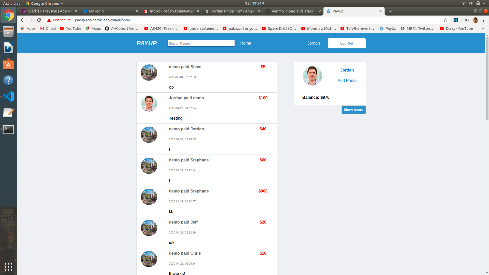
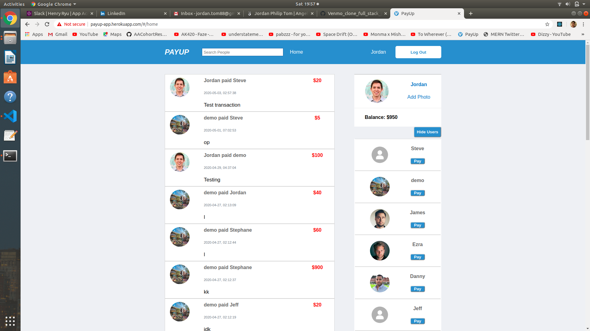
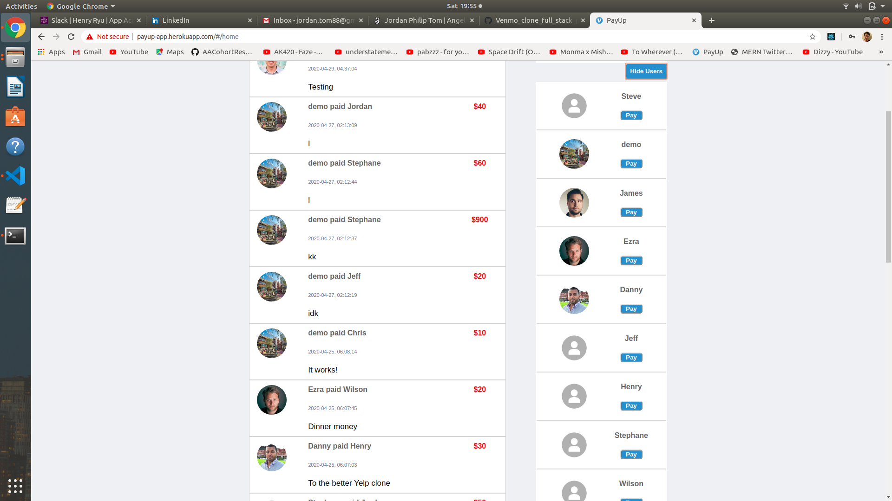

# PayUp
[Live Demo](http://payup-app.herokuapp.com/#/)


PayUp is demonstration web application modeled as a clone of Venmo. The main functionality of the site is to be able to pay to any given amount of money to any user with an account, so long as the payer's balance is adequate for the transaction.

## Technology

1) Ruby 2.5.1
2) Rails 5.2.3
3) PostgreSQL 10.12
4) Javascript 
5) JBuilder
6) React / Redux
7) CSS
8) Webpack

## Features

## 1) User Authentication
Users can create an account, log in, and log out. They can also log in as a guest to test out the app's features. The application stores the user's information in the PostgreSQL database, and hashes the user's password with bcrypt.

**Login Backend**:
```
def create
    @user = User.find_by_credentials(
        params[:user][:username],
        params[:user][:password]
    )

    if @user
        log_in(@user)
        render '/api/users/show'
    else
        render json: ['Invalid username/password combination'], status: 401
    end
end
```
**Login Frontend**:
```
export const login = user => dispatch => (
    SessionAPIUtil.login(user).then(
        user => dispatch(receiveCurrentUser(user)),
        errors => dispatch(receiveErrors(errors.responseJSON)))
)
```



## 2) Payments / Transactions
Users can pay any amount of money to a specified user in the app. All transactions are presented in a feed showing activity from all users. User balances are immediately updated to reflect their appropriate amounts upon successful transaction. New transactions are added to the feed when payment is complete.

**Transaction Form Handling**
```
handleSubmit(e, username){
      e.preventDefault();
      this.props.allUsers.map(user => {
          if(user.username === username) {
              this.userId = user.id
          }
      })

      this.props.createTransaction({
          amount: this.state.amount,
          body: this.state.body,
          payer_id: this.props.currentUserId,
          recipient_id: this.userId
      }).then(() => this.props.fetchUser(this.props.currentUserId).then(()=>{
          this.props.fetchAllTransactions();
      }))

      this.props.closeModal();
}
```




## 3) Users List
All users have access to a toggleable users list, which displays other users with accounts. There, they can choose to pay any specified user.

**Users List Component**
```
let currUser = this.props.currentUser;

if(!this.props.users) return null
const users = this.props.users.map((user, i) => {
    if(currUser.id !== user.id){
        return <UserIndexItem user={user} key={i} 
        transaction={this.props.transaction} 
        createTransaction={this.props.createTransaction} 
        openModal={this.props.openModal} />
    }
})
```


## Features to be Implemented in the Future

## 1) Request 
Users can request money from other users, which will then render in a separate feed for the requestor and requestee only.
The requestor has the choice of deleted his/her request so long as the payment hasn't been processed, while the requestee will be able to fulfill the requested payment, or delete it as he/she chooses.